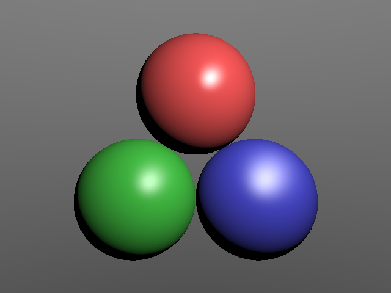

# py_raytracing

## 概要

Pythonで実装した非常にシンプルなレイトレーサーです．次のコマンドを実行すると，球オブジェクトをPhongの反射モデルでシェーディングした画像を生成します．

```python
pyhon main.py
```


<div align="center">
    
</div>

## 開発環境

- Windows10
- Visual Studio Code
- Anaconda3
- Python3.8

## 外部ライブラリ

- Numpy
- pillow
